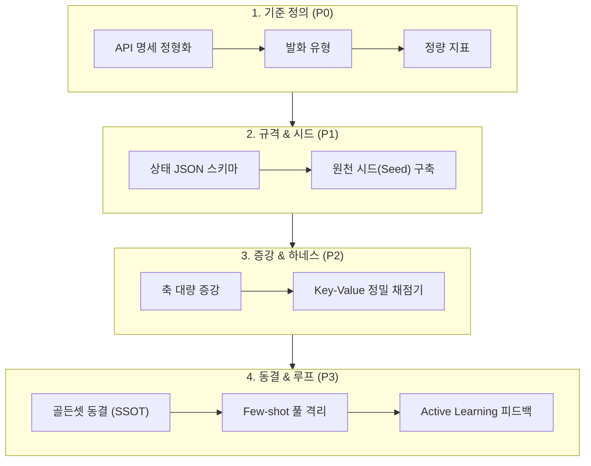
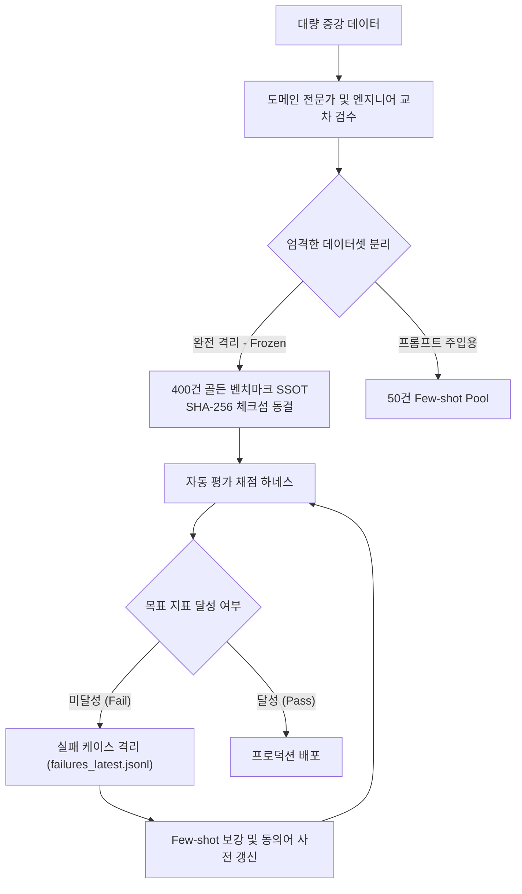

import { ArticleLayout } from '@/components/ArticleLayout'

export const project = {
  author: 'Kim Jin-hwan',
  date: '2026-09',
  title: 'SLM 파이프라인 정량 평가 체계 및 벤치마크 구축 가이드',
  description:
    '자연어 질의를 백엔드 API 호출 계획(Function Calling)으로 변환하는 SLM 파이프라인의 정량 평가 체계 및 골든 벤치마크 구축 가이드',
}

export const metadata = {
  title: project.title,
  description: project.description,
}

export default (props) => <ArticleLayout article={project} {...props} />

# SLM 파이프라인 정량 평가 체계 및 벤치마크 구축 가이드
> **Domain-Agnostic SLM Planning & Function Calling Evaluation Framework**

---

## 📌 1. 개요 및 설계 철학 (Philosophy)

SLM을 활용한 백엔드 API 연동 서비스에서 정량적 성능 평가가 중요하다. 하지만 이를 위한 적절한 체계와 가이드가 없다면 SLM 성능평가는 정성평가로 진행될 수 밖에 없고, 이는 객관적인 성능비교를 어렵게 한다. 정성평가 위주의 SLM 성능평가는 분석가의 주관이 개입될 수 있으며 부족한 체계 안에서 비효율적인 테스트 반복을 하게 하여 프로젝트 진행에 비효율을 가져올 수 있다. 또한 정성평가는 평가자 간의 일관성이 부족하여 신뢰할 수 없는 결과를 초래할 수 있다.

따라서 본 문서는 특정 도메인이나 특정 백엔드 API에 종속되지 않고, **자연어 질의를 백엔드 API 호출 계획(Function Calling / JSON Plan)으로 변환하는 모든 SLM 파이프라인에 적용할 수 있는 범용 정량 평가 체계 및 벤치마크 구축 가이드**에 대하여 기술한다.

---

## 2. 구축 라이프사이클





### 🔴 Phase 0. API 분류 체계 및 정량 지표 정의

어떤 API 서버를 붙이든 가장 먼저 **API 인터페이스를 정형화하고, 사용자의 발화 패턴과 평가 지표를 정의**해야 한다.

#### 1) API 카탈로그 정형화
* API 엔드포인트를 SLM이 인식하기 좋은 **Function 명세**로 추상화한다.
* **필수(Required) vs 선택(Optional)** 인자를 명확히 분리한다.
* 파라미터별 **Enum 허용치 및 유효 범위**를 규격화한다.
> 파라미터에 대한 규격화가 되지 않는다면 SLM은 임의로 값을 추측하여 호출하므로, 정확한 호출을 어렵게 만든다.

#### 2) 발화 유형
사용자의 모든 자연어 입력은 다음 5가지 범주로 분류된다.

| 발화 유형 | 의도 정의 | 모델 기대 동작 |
| :--- | :--- | :---: |
| **1. 정상 호출 (Positive)** | 필요한 인자가 모두 포함된 일반적인 요청 | `EXECUTE` (즉시 실행) |
| **2. 정보 누락 (Incomplete)** | 필수 파라미터가 빠진 불완전한 요청 | `CLARIFY` (되묻기 유도) |
| **3. 복합 명령 (Composite)** | 2개 이상의 API를 순차/병렬로 실행해야 하는 요청 | `EXECUTE_MULTI` (다단계 파이프라인) |
| **4. 도메인 외/거절 (Negative)** | 시스템 지원 범위를 벗어나거나 비인가된 요청 | `REJECT` (안전 거절) |
| **5. 현장 노이즈 (Noisy)** | 오타, 축약어, 구어체/사투리, 띄어쓰기 오류가 포함된 요청 | `EXECUTE` 또는 `CLARIFY` |

#### 3) 핵심 정량 평가 지표 (Quantitative Metrics)
단순한 텍스트 유사도(BLEU/ROUGE)가 아닌 **백엔드 API 호출의 물리적 실행 무결성**을 다각도로 측정하는 5단계 계층 지표를 수립한다.

| 평가 지표 (Metric) | 측정 목적 및 정의 | 산출 공식 (Formula) | 목표치 (Target) |
| :--- | :--- | :--- | :---: |
| **JSON 스키마 준수율<br/>(SVR)** | 출력이 문법적 오류 없는 Valid JSON인지 검증 | (Valid JSON 출력 건수 / 전체 평가 건수) × 100 | **100%** |
| **API 라우팅 정확도<br/>(ARA)** | 질문의 의도에 맞는 함수 및 상태(`status`) 선택 여부 | (정확한 API·상태 선택 건수 / 전체 평가 건수) × 100 | **≥ 95.0%** |
| **인자 완전 일치율<br/>(Slot EM)** | 추출된 모든 파라미터 Key-Value가 100% 일치하는지 검증 | (모든 인자가 완전 일치한 건수 / 전체 평가 건수) × 100 | **≥ 90.0%** |
| **인자 Slot F1-Score<br/>(Slot F1)** | 인자 생성의 정밀도(환각 방지)와 재현율(누락 방지) 조화평균 | 2 × (Precision × Recall) / (Precision + Recall) | **≥ 94.0%** |
| **되묻기 적합도<br/>(Clarify Acc)** | 정보 누락 질의에 대해 빠진 인자를 정확히 지목했는지 검증 | (누락 인자를 정확히 짚어낸 건수 / CLARIFY 평가 건수) × 100 | **≥ 92.0%** |
| **종합 E2E 성공률<br/>(E2E Success)** | **[최종 합격선]** 상태, 함수, 인자가 모두 무결하게 통과한 비율 | (모든 지표를 완전 무결 통과한 건수 / 전체 평가 건수) × 100 | **≥ 90.0%** |

> 💡 **운영 기준**: 최종 종합 E2E 성공률 90% 이상을 합격선(Baseline Gate)으로 설정하며, 목표치에 도달할 때까지 **"오답 분석 → Few-shot/사전 보강 → 재평가"** 루프를 반복한다.

---

### 🟠 Phase 1. 정답 표준 규격화 & 원천 시드 수집

#### 1) Discriminated Union 정답 JSON 스키마 설계
어떤 도메인이든 `status` 필드를 기준으로 명확히 분기되는 표준 JSON 스키마를 정의한다.

```json
/* 1. 단일 실행 */
{ "status": "EXECUTE", "function_name": "api_name", "arguments": { "key": "value" } }

/* 2. 누락 파라미터 되묻기 */
{ "status": "CLARIFY", "target_function": "api_name", "missing_parameters": ["param1"], "message_to_user": "..." }

/* 3. 복합 다단계 실행 */
{ "status": "EXECUTE_MULTI", "pipeline": [{ "step": 1, "function_name": "...", "arguments": {...} }] }

/* 4. 거절 */
{ "status": "REJECT", "reason": "OUT_OF_DOMAIN", "message_to_user": "..." }
```

#### 2) 원천 시드(Seed) 수집
* 전체 API 엔드포인트와 발화 유형을 골고루 커버하는 고품질 골든 시드 작성
* Pydantic v2 등 강력한 타입 검증 모듈을 통해 시드 데이터의 무결성을 전수 사전 검증

---

### 🟡 Phase 2. 대량 데이터 증강 & 자동 채점 하네스

#### 1) 축(Axes) 대량 합성 데이터 증강
시드 데이터를 기반으로 SLM을 활용해 400~1,000건 규모로 자동 증강한다.
* **축 1. 어조/문체 다양화**: 공손체, 단문 키워드, 의문문, 명령형, 보고서형
* **축 2. 도메인 노이즈 주입**: 오타, 띄어쓰기 생략, 전문 은어, 음차 표기
* **축 3. 파라미터 경계값/퍼징**: 상대 시간("어제", "지난주"), 경계값, 복합 필터

#### 2) Key-Value 정밀 자동 채점 엔진
문자열 단순 비교의 한계를 극복하는 의미론적(Semantic) 타입 채점 알고리즘을 적용한다.
* **타입 유연성 (Type Casting)**: 정수 `"10"` vs `10` 동일 취급
* **순서 무관 집합 비교 (Set Equality)**: `["A", "B"]` vs `["B", "A"]` 동일 취급
* **상대 일시 정규화 (Temporal Normalization)**: `"어제"` → Context 기준 `YYYY-MM-DD` 환산 후 비교
* **다단계 파이프라인 채점**: 순서 및 중간 인자 의존성 검증

---

### 🟢 Phase 3. 골든 벤치마크 동결 & 지속 개선 체계



1. **단일 진실 공급원(SSOT) 동결 (Freezing & Checksum Verification)**
   * **개념 및 기술적 원리**:
     * 평가 데이터 파일(`golden_benchmark_v1.0.jsonl`)의 내용 전체를 바이트 단위로 해싱하여 고유한 64자리 SHA-256 해시값(Checksum)을 산출한다.
     * 이 해시값은 버전 매니페스트(`dataset/manifest.json` 또는 평가 보고서) 및 `evaluate.py` 스크립트 내에 기대값으로 영구 기록된다.
   * **임의 수정을 원천 차단하는 기술적 메커니즘**:
     * **(1) 런타임 무결성 검사 (Integrity Check)**: `evaluate.py` 실행 시작 시 데이터셋의 SHA-256을 실시간 계산하며, 띄어쓰기 1칸이나 1글자라도 수정되면 해시가 불일치하여 `DatasetTamperedError`를 발생시키고 평가를 즉시 중단한다.
     * **(2) CI/CD 배포 파이프라인 차단 (Automated Gatekeeper)**: Git PR이나 배포 파이프라인에서 데이터셋 해시가 공인된 버전과 다를 경우 머지 및 빌드를 자동 거부한다.
     * **(3) 버전 관리 불변성 (Immutability)**: Git Tag(`v1.0.0`) 및 스토리지(DVC, S3 Object Lock)에 읽기 전용(Read-Only)으로 박제하여 임의 덮어쓰기를 방지한다.
   * **필요성 및 이유**:
     * **평가 기준의 불변성(객관성) 확보**: 모델이 오답을 낸다고 해서 개발자가 평가 데이터를 임의로 고치면 "진짜 모델이 좋아진 건지, 시험 문제가 쉬워진 건지" 비교할 수 없게 된다.
     * **회귀(Regression) 방지 기준점(Anchor)**: 프롬프트나 코드를 1줄 수정했을 때 기존 기능이 망가졌는지 객관적으로 검증하려면 '절대 변하지 않는 표준 줄자'가 필수적이다.

2. **데이터 누수 방지 (Anti-Contamination & Data Separation)**
   * **평가 전용 벤치마크(Frozen Golden Set)**: 모델에게 절대 프롬프트(Few-shot)나 파인튜닝 학습 데이터로 노출하지 않고 순수 시험용으로만 격리한다.
   * **프롬프트 Few-shot 풀**: 런타임 프롬프트에 예시로 주입할 데이터는 별도의 풀로 분리 관리한다.
   * **필요성 및 이유**:
     * 시험 문제를 미리 보고 치르는 시험은 100점을 맞아도 의미가 없듯, 모델이 프롬프트로 미리 정답을 본 상태에서 평가를 진행하면 **"문제를 외워서 맞히는 과적합(Overfitting) 착시"**가 발생한다.
     * 실운영 환경에서 처음 보는 다양한 변형 질문에 대한 모델의 **진정한 일반화(Generalization) 능력**을 측정하기 위해 시험지와 연습문제를 물리적으로 완벽히 격리해야 한다.

3. **Active Learning 피드백 루프 (Continuous Improvement)**
   * 채점 중 실패한 케이스(`failures_latest.jsonl`)를 자동 격리하여 오답 원인을 분석한다.
   * **개선 반영**: 고정된 골든셋을 수정하는 것이 아니라, **Few-shot 풀에 유사 예시를 보강**하거나 **도메인 동의어 사전을 갱신**한 뒤 다시 동일한 골든셋으로 재평가하여 목표 지표(E2E ≥ 90%)를 달성하는 선순환 구조를 완성한다.

---

## 3. 다른 API 서버로의 범용 확장 가이드 (Pluggable Architecture)

새로운 API 서버(예: ERP, 물류 WMS, 고객 CRM 등)를 연동할 때 수정해야 하는 범위는 극히 일부로 캡슐화됩니다.

```
slm-assessment
├── dataset/
│   ├── seed_dataset.jsonl              <-- [신규 도메인 API 시드 데이터로 교체]
│   ├── golden_benchmark_v1.0.jsonl     <-- [신규 도메인 증강 벤치마크셋]
│   └── fewshot_pool.jsonl              <-- [신규 도메인 Few-shot 풀]
├── eval/
│   ├── schema.py                       <-- [신규 API 인자 Pydantic 모델 정의]
│   ├── augment.py                      <-- (재사용) 공통 증강 엔진
│   ├── evaluate.py                     <-- (재사용) 공통 자동 채점 하네스
│   └── validate_dataset.py             <-- (재사용) 공통 데이터 검증기
```

### 다른 API 서버 연동 시 수행 단계
1. **`eval/schema.py`**: 신규 API의 함수명 및 파라미터 Pydantic 클래스 정의
2. **`dataset/seed_dataset.jsonl`**: 신규 API 기반 시드 작성
3. **`eval/augment.py` 실행**: 대량 증강 및 골든셋 생성
4. **`eval/evaluate.py` 실행**: 모델의 API 호출 능력 즉시 측정 및 프롬프트 안정화
